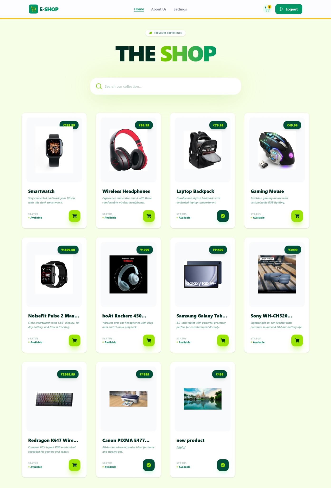
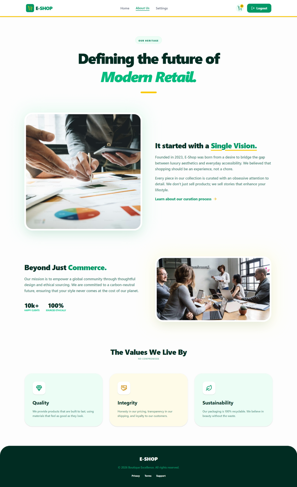
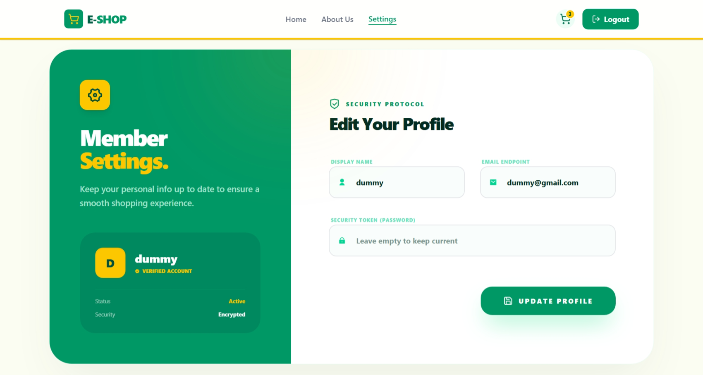
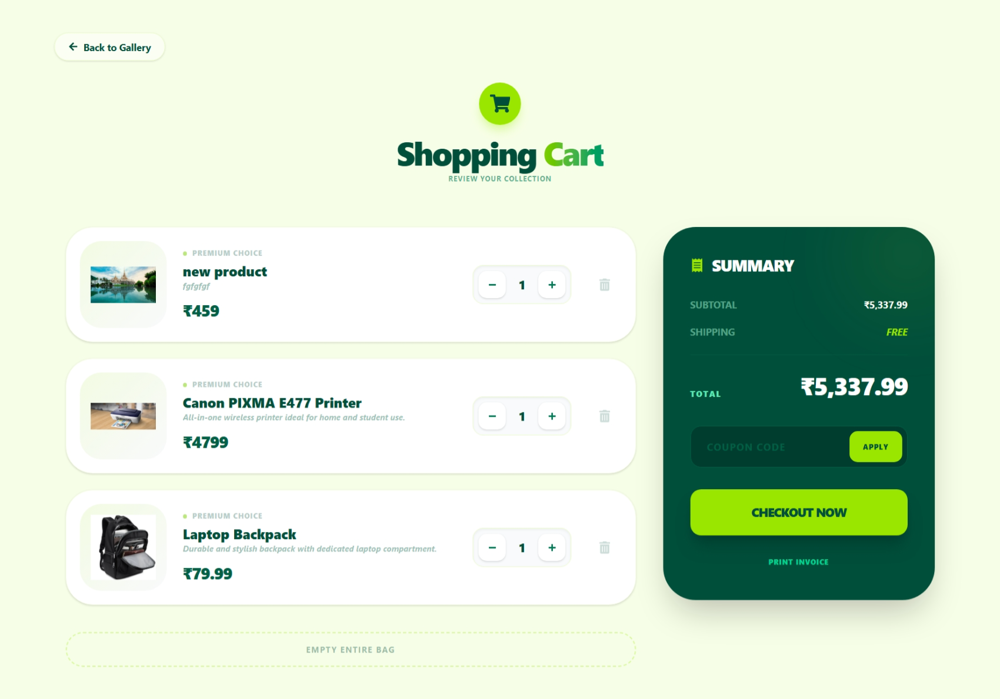
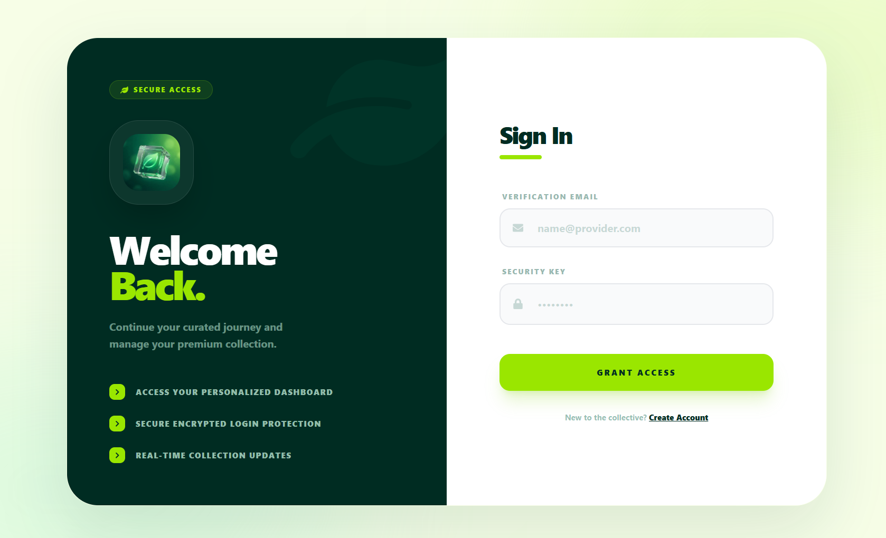
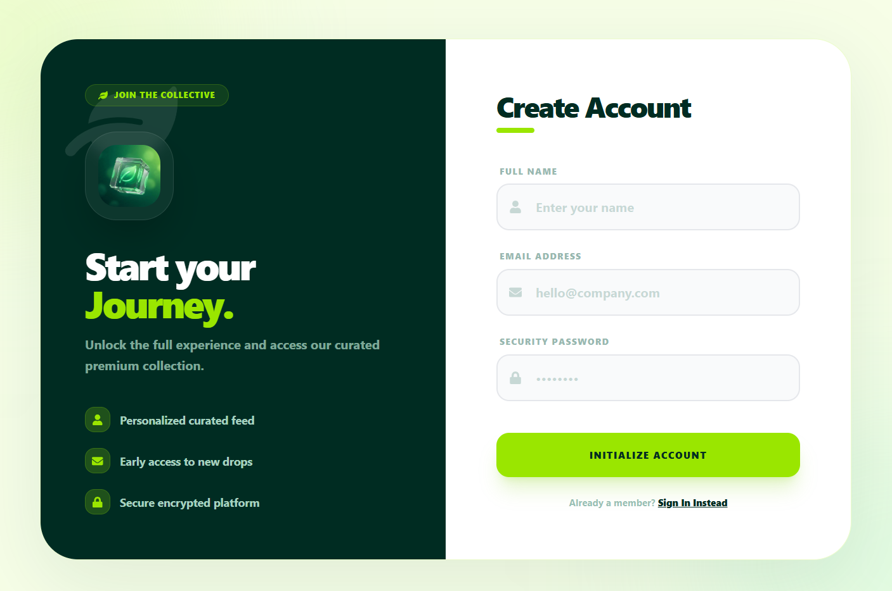
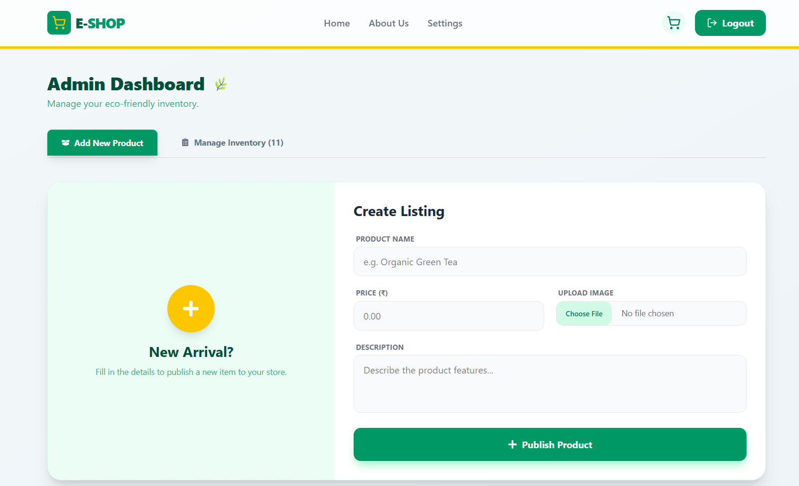
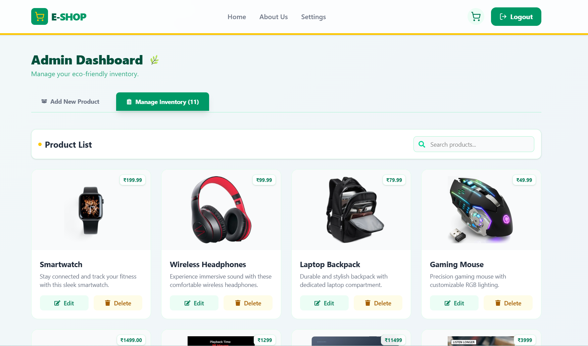
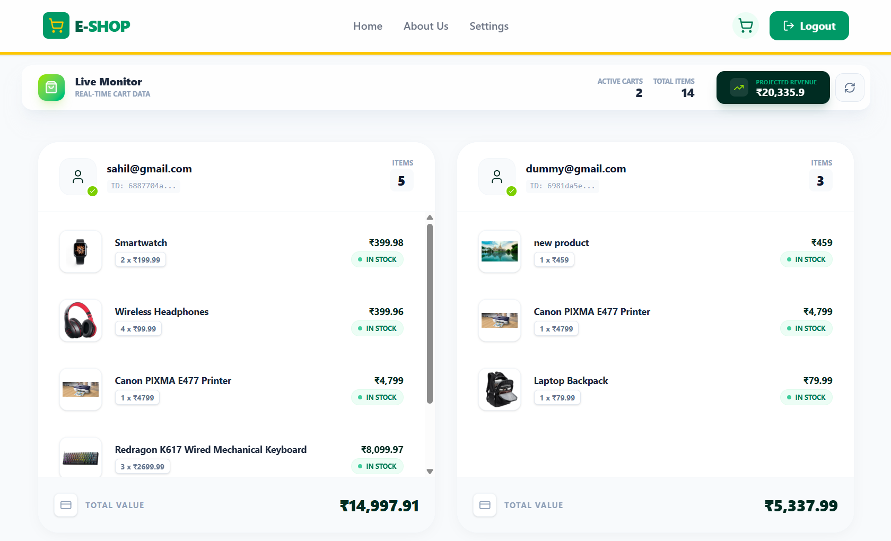

# 🛒 E-SHOP – Full Stack E-Commerce Platform

E-SHOP is a modern full-stack e-commerce web application built using **React, Tailwind CSS, Node.js, MongoDB, and JWT Authentication**. It delivers a complete shopping experience with secure login, product management, cart system, and admin dashboard.

---

## 🚀 Project Overview

This project is designed to demonstrate real-world full-stack development skills. It includes user authentication, product listing, cart management, admin controls, and secure backend APIs.

The application focuses on performance, security, and clean UI/UX design.

---

## ✨ Key Features

### 👤 User Module

* User Registration & Login
* JWT-Based Authentication
* Encrypted Passwords using bcrypt.js
* Product Browsing
* Add to Cart / Remove from Cart
* Quantity Management
* Checkout Summary
* Profile Settings
* Responsive Design

### 🛠 Admin Module

* Admin Dashboard
* Create / Update / Delete Products
* Image Upload with Multer
* Inventory Management
* Live Cart Monitoring
* Revenue Overview
* Product Search & Filtering

### 🔐 Security System

* Token-Based Authentication (JWT)
* Password Hashing (bcrypt.js)
* Protected Routes
* Secure REST APIs
* Role-Based Access (User / Admin)

---

## 🧩 Tech Stack

### Frontend

* React.js
* Tailwind CSS
* Framer Motion
* Axios

### Backend

* Node.js
* Express.js
* MongoDB (Mongoose)
* JWT (JSON Web Token)
* bcrypt.js
* Multer

### Database

* MongoDB Atlas / Local MongoDB

---

## 📂 Folder Structure

```
E-SHOP/
│
├── client/               # React Frontend
│   ├── src/
│   ├── components/
│   ├── pages/
│   └── assets/
│
├── server/               # Node Backend
│   ├── models/
│   ├── routes/
│   ├── controllers/
│   ├── middleware/
│   └── uploads/
│
├── .env
├── package.json
└── README.md
```

---

## 📊 Application Modules

### 🏠 Home

* Featured Products
* Search Bar
* Category Browsing

### 🛒 Shop

* Product Grid
* Price Display
* Availability Status
* Add to Cart

### 🛍 Cart

* Item List
* Quantity Controls
* Price Calculation
* Checkout Button

### 👤 Profile

* User Information
* Email Management
* Password Update
* Security Status

### 🧑‍💼 Admin Panel

* Product Listing
* Product Editor
* Inventory Control
* Order Tracking
* Analytics View

---

## 📈 Performance & Optimization

* Optimized API Calls
* Lazy Loading
* Efficient State Management
* Clean Component Structure
* Reusable UI Components

---

## 🎯 Project Highlights

* Full MERN Stack Implementation
* Secure Authentication System
* Modern UI Design
* Real-Time Data Monitoring
* Scalable Architecture
* Production-Ready Codebase

---

## ⚙️ Environment Configuration

This project uses environment variables for both frontend (Vite) and backend (Node.js) configuration.

---

### 🌐 Frontend Environment (`client/.env`)

Create a `.env` file inside the `client` folder and add the following:

```
VITE_API_URL=
VITE_COMPARE_URL=
VITE_VERIFY_URL=
VITE_REMOVE_COOKIE_URL=
VITE_PRODUCT_URL=
VITE_PRODUCT_IMAGE_URL=
VITE_GET_SINGLE_PRODUCT_URL=
VITE_CART_URL=
VITE_CURRENT_USER_TOKEN_URL=
VITE_SINGLE_USER_URL=
```

#### Explanation

* `VITE_API_URL` → User authentication API
* `VITE_PRODUCT_URL` → Product management API
* `VITE_CART_URL` → Cart system API
* `VITE_PRODUCT_IMAGE_URL` → Product image access path
* `VITE_VERIFY_URL` → Email / account verification
* `VITE_COMPARE_URL` → Product comparison
* `VITE_CURRENT_USER_TOKEN_URL` → Token verification

All variables starting with `VITE_` are accessible in React using:

```js
import.meta.env.VITE_API_URL
```

---

### 🖥 Backend Environment (`server/.env`)

Create a `.env` file inside the `server` folder and add:

```
PORT=
MongoDbUri=
JWTSECRET=
```

#### Explanation

* `PORT` → Backend server port
* `MongoDbUri` → MongoDB database connection
* `JWTSECRET` → Secret key for JWT authentication

These variables are accessed using:

```js
process.env.PORT
process.env.MongoDbUri
process.env.JWTSECRET
```

---

## 🖼 Application Screenshots

Below are some preview screenshots of the E-SHOP platform. Add your project images here.

### 📱 User Interface

* Home Page
* Product Listing
* Cart Page
* Login / Register
* Profile Settings

### 🧑‍💼 Admin Panel

* Admin Dashboard
* Add Product Page
* Inventory Management
* Live Cart Monitor

 ## screenshots :

 
 
 
 
 
 
 
 
 


---

**Developed by:** Master Sahil

**Role:** Full Stack MERN Developer

---

## 📄 License

This project is for educational and portfolio purposes.
All rights reserved © 2026
